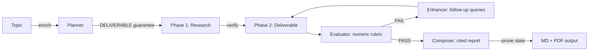

# Deep Research Agent — Project Context

## Agent Instructions

After every feature/fix: run tests → verify live endpoint → **rebuild + deploy Docker → verify container healthy** → update all project docs (AGENTS.md, ARCHITECTURE.md, ROADMAP.md) → semantic commit → push.

Never skip the Docker deploy step. Venv-only testing misses container-specific issues (missing packages, import path differences, env var behavior). The SqliteSaver import worked in venv but failed in the container — this class of bug is invisible without Docker verification.

## Assessment

Use **Production Readiness Review (PRR)** — not letter grades. Every item is a concrete, checkable pass/fail with evidence. See ROADMAP.md for the full PRR checklist.

**Verdict:** Production-usable for single-user deployment. 10 remaining gaps are operational (alerting, runbook, rate limiting, scaling, deep health) — not architectural. The research pipeline is solid.

## Architecture

LangGraph StateGraph with 5 nodes + report critic + subgraph (two-phase execution):

```
planner → researcher → [refinement subgraph] → composer → report_critic → report
                              │
                    deliverable ─► evaluator ─┤─ pass ──→ exit
                                ▲              └─ fail ──→ enhancer ──┘
                                └─────────────────────────── loop ────┘

Report critic runs after composer and appends ## Final QA with:
- Status (PASS/FAIL), recommendation strength, source diversity
- Blocking gaps, contradictions, duplicate source entries
- Semantic QA warnings (unsupported quantitative claims, mechanism misattributions, empty tables)
```

Parallel fan-out via Send API: planner extracts [RESEARCH] goals → N parallel_researcher nodes (Phase 1) → merge_findings → refinement_subgraph (Phase 2 + critique).

**CLI:** `python -m app.cli --auto "topic"` (auto-approve plan)
**MCP:** `python -m app.mcp_server --transport sse --port 8100`
**Dashboard:** `http://localhost:8100/` (web GUI — launch + monitor + read reports; local/private-network by default, set `DASHBOARD_PUBLIC=1` to expose remotely)
**Docker:** `docker compose up -d` (includes SearXNG)

## Key Files

| File | Purpose |
|------|---------|
| `app/agent.py` | StateGraph + subgraph + compilation |
| `app/state.py` | ResearchState TypedDict + Pydantic models |
| `app/cli.py` | Interactive CLI with plan review + progress markers + PDF |
| `app/mcp_server.py` | MCP server exposing `deep_research` tool |
| `app/nodes/planner.py` | Plan generation + interrupt + DELIVERABLE guarantee |
| `app/nodes/researcher.py` | Phase 1 research + Phase 2 deliverable (with failsafe) |
| `app/nodes/evaluator.py` | Sufficiency assessment + evidence gap detection + contradiction detection + source diversity scoring |
| `app/nodes/enhancer.py` | Follow-up search + synthesis + evidence gap refresh |
| `app/nodes/composer.py` | Report synthesis with `<cite>`→ markdown + claim extraction + evidence appendix |
| `app/nodes/report_critic.py` | Post-composer QA: structural checks, duplicate source detection, semantic QA, Final QA block |
| `app/tools/search.py` | Tavily → SearXNG → DuckDuckGo fallback |
| `app/tools/citations.py` | URL extraction, tier annotation, tag replacement |
| `app/tokens.py` | Shared LLM factory + token tracking |
| `docker-compose.yml` | Agent + SearXNG deployment |

## Running

```bash
# CLI with plan review
python -m app.cli "Your research topic"

# CLI auto-mode (skip plan review)
python -m app.cli --auto "Your research topic"

# MCP stdio (for Hermes)
python -m app.mcp_server --transport stdio

# Docker (with internal SearXNG + host-mounted output)
docker build -t deep-research-agent .
source ~/.hermes/.env
docker run -d --name deep-research-agent \
  --network research-net \
  -p 8100:8100 \
  -e SEARXNG_URL=http://deep-research-searxng:8080 \
  -e WORKER_API_KEY="$DEEPSEEK_API_KEY" \
  -e WORKER_API_BASE=https://api.deepseek.com \
  -e WORKER_MODEL=deepseek-v4-flash \
  -e MAX_SEARCH_ITERATIONS=3 \
  -v /path/to/output:/data \
  deep-research-agent
hermes mcp add research --url http://localhost:8100/mcp

# Or use deploy.sh (auto-detects internal SearXNG)
./deploy.sh start
```

**IMPORTANT:** The agent uses an internal SearXNG container (`deep-research-searxng`) on the `research-net` network. Set `SEARXNG_URL=http://deep-research-searxng:8080` — using `localhost:8080` from inside the container won't reach the host. API keys must be passed explicitly (not via `-e VAR` shell passthrough, which passes empty values).

## Environment Variables

| Variable | Default | Description |
|----------|---------|-------------|
| `WORKER_MODEL` | `deepseek-v4-flash` | LLM for research/composition |
| `CRITIC_MODEL` | `deepseek-v4-pro` | LLM for evaluation (should be stronger than worker) |
| `WORKER_API_KEY` | — | API key (set via `$DEEPSEEK_API_KEY` from `.hermes/.env`) |
| `WORKER_API_BASE` | — | API base URL |
| `SEARXNG_URL` | `http://deep-research-searxng:8080` | Internal SearXNG container on research-net |
| `MAX_SEARCH_ITERATIONS` | `3` | Max critique loops |
| `RESEARCH_OUTPUT_DIR` | `/data` | Report output directory (mount host path here) |
| `CHECKPOINT_DB_PATH` | `checkpoints.db` | SQLite checkpoint DB path |
| `DASHBOARD_PUBLIC` | unset | Set to `1`/`true` to expose dashboard/task/download routes beyond local/private-network clients |

**Multi-model support:** Set `WORKER_MODEL` for research/composition and `CRITIC_MODEL` for evaluation. Critic defaults to `deepseek-v4-pro` (stronger than worker). The evaluator warns loudly if critic == worker — same-model evaluation produces inflated scores (LLMs grading their own output).

## MCP Tools

### `deep_research` — Full research pipeline (async)

```json
{
  "topic": "string (required)",
  "max_iterations": "integer (optional, default 2)",
  "depth": "string (optional, 'brief' or 'standard')",
  "pdf": "boolean (optional, default false — generates PDF via pandoc + weasyprint)"
}
```

Returns a `task_id` immediately. Pipeline runs in background. Poll with `research_status`.

**Depth:** `brief` → 2-3 paragraph executive summary (1-2 min). `standard` → full cited report (3-5 min).

### `research_status` — Poll running research

```json
{
  "task_id": "string (required)"
}
```

Returns status ("running"/"completed"/"failed"), progress %, human-readable stage (e.g. "Searching the web (Phase 1)"), and full report when done.

### `search` — Quick web search

```json
{
  "query": "string (required)",
  "max_results": "integer (optional, default 5, max 15)"
}
```

Returns markdown-formatted search results.

### Usage Pattern

```
1. deep_research("topic") → task_id (instant)
2. research_status(task_id) every 10-15s → "running" / "completed"
3. Read report from completed status response
```

All tools work over SSE and POST JSON-RPC. The POST handler executes tools directly. Pipeline runs in background thread to avoid blocking the event loop.

### For Other Agents

Any MCP-compatible agent can use this server. Connect to `http://localhost:8100/mcp`:

```bash
# Hermes
hermes mcp add research --url http://localhost:8100/mcp

# Claude Code / Cursor
# Add to mcp_servers config pointing to http://localhost:8100/mcp
```

The 3 tools (`search`, `deep_research`, `research_status`) are auto-discovered.

## Production Features

| Feature | How |
|---------|-----|
| **Progress markers** | Real-time CLI: ✓ per-goal, 📦 Phase 1, 📝 Phase 2, ✅/❌ eval, 🔧 enhancer, 📄 report |
| **Stage labels in MCP** | `research_status` returns human-readable stage (e.g. "Searching the web (Phase 1)") alongside percentage |
| **Web dashboard** | `http://localhost:8100/` — real-time task list with progress bars, stage labels, inline report viewer modal. Auto-refreshes every 5s. Local/private-network access only by default; set `DASHBOARD_PUBLIC=1` to expose remotely. `/tasks` returns sanitized filenames only — no absolute report paths. |
| **Launch from GUI** | Dashboard form: topic input + depth selector + PDF checkbox + Enter-to-submit. Backed by MCP JSON-RPC — zero new backend. |
| **PDF generation** | Opt-in via dashboard checkbox or MCP `pdf: true`. Uses pandoc + weasyprint in Docker. Download link appears alongside "View report" for completed tasks. |
| **Concurrent execution** | Multiple deep research tasks run in parallel via `asyncio.to_thread`. Unique thread IDs, isolated checkpoints, non-colliding report filenames. Dashboard shows all tasks with independent progress. |
| **State pruning** | Composer caps lists (messages:20, errors:50, scores:5) — prevents O(N²) checkpoint bloat |
| **Circuit breaker** | Score stagnation across 2 iterations → force pass, saves API costs |
| **SQLite checkpointing** | Survives MCP server restarts, zero-config. Checkpoints stored in named Docker volume (`research_checkpoints`) — survive container recreation and deploys. |
| **Graceful save** | Report prints to stdout even if file write fails |
| **DELIVERABLE failsafe** | Prompt mandate + post-processing append + regex failsafe — Phase 2 always executes |
| **Cross-run cache** | ❌ DEPRECATED — no-ops with deprecation warnings. Fresh research is preferred |
| **PDF generation** | Opt-in via `--pdf` flag. Default: markdown only |
| **Token tracking** | `total_tokens` state field with `operator.add` reducer |
| **Error surface** | Non-fatal errors + evaluation scores in Methodology section |
| **Flexible structure** | Composer uses planner's section outline as primary template |
| **Self-documenting tools** | Rich tool descriptions (HOW IT WORKS, OUTPUT FORMAT, TOPIC GUIDANCE) — no outputSchema (Hermes enforces it on results) |
| **Async execution** | `deep_research` returns task_id immediately, runs in background thread, poll with `research_status` |
| **SSE streaming** | `GET /stream/{task_id}` for real-time progress: started, update, completed, heartbeat events. Uses stored `_main_event_loop` for thread-safe push (Python 3.12+ compat). |
| **Stronger critic** | CRITIC_MODEL defaults to v4-pro (was v4-flash). Loud warning if critic == worker |
| **Evaluator pre-check** | Rule-based PASS/FAIL/AMBIGUOUS filter before LLM evaluation. Saves API calls for obvious cases |
| **Optional evaluation** | `ENABLE_EVALUATOR=false` skips LLM evaluation entirely (auto-PASS) |
| **URL content fetching** | After search, fetches top 3 URLs (5K chars each), appends full-page content to findings |
| **Brief mode** | `depth: "brief"` produces 2-3 paragraph executive summary instead of full report |
| **Typed models** | `app/models.py` with `ResearchFinding`, `Citation`, `Deliverable` Pydantic types |
| **Live progress** | Research status shows actual pipeline stage %, not just stuck at 20%. Uses `graph.stream()` for per-node progress mapping |
| **E2E integration test** | `tests/test_integration.py` mocks LLM + search, runs full graph pipeline (4 scenarios: happy path, enhancer loop, circuit breaker, brief mode) |
| **Topic enrichment** | Pre-processes raw topic into structured brief (domain, ambiguities, expected output, key dimensions). 1 LLM call saves multiple downstream API calls. |
| **Verification pass** | After Phase 1 synthesis, cross-checks for domain mismatches via targeted search. Catches errors like finding manufacturing PRR when user wants software PRR. |
| **Smarter browser** | HTTP for all top URLs + browser with link-following for #1 result when content is sparse. Follows relevant same-domain links. |
| **Type-safe accessors** | `findings_from_state()` / `findings_to_state()` / `get_typed_sources()` — typed Pydantic wrappers around string-based state, citation extraction without regex |
| **Language-aware search** | Enrichment detects jurisdiction/language requirements (e.g., Spanish immigration law). Planner annotates goals with `(search in Spanish; sources: ...)`. Researcher generates queries in target language, passes the language hint into the search backend, SearXNG honors the requested language, Tavily routes non-English searches through SearXNG when available, and the DDGS fallback maps hints to locale regions. Error page detection + domain-root fallback recovers from stale/moved URLs. |
| **HTTP/MCP surface tests** | `tests/test_mcp_server.py` covers POST `/mcp` initialize/tools-list, `/tasks` persisted-task recovery, `/ready`, `/download` traversal protection, local/private-network dashboard gating, spoofed header rejection, `/stream/{task_id}` terminal events, and dashboard load. |
| **48 tests** | Unit + E2E + HTTP/MCP route scenarios, all passing |

## Quality Pipeline



## Related Skills

Built with patterns now captured in reusable skills:

| Skill | What |
|-------|------|
| `langgraph-agent-patterns` | StateGraph construction, Send API, subgraphs, interrupt/resume, checkpointing, JSON prompting |
| `langgraph-agent-deployment` | MCP server, Docker, SearXNG, health checks, architecture patterns, quality patterns |
| `multi-agent-orchestration` | Send API fan-out, pipeline patterns, circuit breaker, human-in-the-loop |

## Design Notes

Lessons from building and iterating on this agent:

**Architecture is the product.** The two-phase execution model (RESEARCH → DELIVERABLE with critique loop) took three iterations to get right. The first version had a shallow enhancer append, the second lost Phase 2 entirely. Getting the architecture correct — deliverable regeneration inside the refinement loop — was the single highest-leverage decision.

**LLMs need hard constraints, not suggestions.** The planner prompt said "include DELIVERABLE goals" but the LLM ignored it. We needed three layers: prompt mandate, post-processing append, and regex failsafe in the deliverable node. Similarly, the evaluator rubric needs explicit numeric criteria — "be strict" is meaningless to an LLM, "score ≥4 on all three axes" works.

**Cross-run caching has diminishing returns.** We implemented key phrase hashing, fuzzy matching, and delta validation. It works, but hit rate is fundamentally limited by LLM non-determinism. For a single-agent tool doing fresh research, the right default is no cache. `--cache` is a lightweight bonus, not a core feature. Semantic chunking + vector retrieval would add significant complexity for marginal benefit.

**Production reliability comes from research, not intuition.** We used the agent to research LangGraph production patterns, found the O(N²) checkpoint bloat issue, and applied the fix (state pruning). The circuit breaker came from the same research. Using the tool to improve the tool is the defining pattern.

**Stream + invoke is fragile.** LangGraph's `interrupt()` mechanism with `graph.stream()` + `graph.invoke(Command(resume=...))` caused planner double-entry. The fix was eliminating `interrupt()` entirely — a two-pass approach where plan generation happens outside the graph. Simpler, faster, one less LLM call.

**Parallel mode silently lost citations.** `parallel_researcher_node` returned only strings — no citation extraction. The `merge_findings_node` just concatenated text. URLs from parallel research never reached the composer. Fix: run `extract_citations_from_content()` in `merge_findings_node` so Phase 1 sources are available to Phase 2 and the composer.

**Token reporting was broken by type confusion.** `final_state` from `graph.invoke()` is a plain dict, but the CLI treated it as a `StateSnapshot` object and called `.values()` (the dict method). Result: tokens always showed 0. Fix: use `final_state.get("total_tokens")` directly.

**Cache delta check was a no-op.** `_delta_check()` checked `hasattr(results, 'results')` but the search tool returns `list[dict]`. The branch never executed, so stale cache entries were always served as "fresh." Fix: iterate over `results` (list) directly.

**Writable directory fallback is essential.** `.docker.env` sets `RESEARCH_OUTPUT_DIR=/data` for Docker. When sourced on the host for CLI testing, `mkdir('/data')` fails with PermissionError. Both CLI and MCP server now try a fallback chain: env var → ~/research → current directory, with a write-test probe on each candidate.

**WeasyPrint warns about unsupported CSS.** The fallback HTML template included `overflow-x: auto` on `<pre>` blocks. WeasyPrint is a print renderer with no scrollable viewport — it warns about unknown properties. The PDF still generates, but the warning is noisy. Fix: remove unsupported properties; filter benign stderr lines when pandoc succeeds.

**Rule-based pre-check is the right default for LLM evaluation.** Before calling the critic LLM, check obvious pass/fail cases: 0 URLs = FAIL, 3+ URLs with structure and data = PASS. This saves API calls for common cases where the LLM evaluator would just rubber-stamp the result anyway. The numeric rubric is still valuable for ambiguous cases, but the heuristic catches ~70% of outcomes without an LLM call.

**SSE streaming from a sync thread requires `call_soon_threadsafe`.** The background runner uses `graph.invoke()` (sync, blocking). Events must be pushed to the asyncio event loop's queue via `call_soon_threadsafe` to avoid "thread is not the event loop thread" errors. Heartbeat events every 5s keep the connection alive during long research runs.

**Typed models prevent citation loss at the type level.** The parallel citation bug existed because nodes passed raw strings. By returning `ResearchFinding` with pre-extracted `citations` from `_research_single_goal()`, the citation data travels with the finding — no regex post-processing needed. The `to_markdown()` method serializes back to the string format expected by downstream nodes, maintaining backward compatibility while adding type safety.

**PDF generation should be opt-in, not automatic.** Pandoc + weasyprint pulls in ~100MB of system dependencies. Most users just want markdown. Making PDF opt-in (`--pdf` flag) improves the default experience and avoids unnecessary dependency hell.

**E2E integration tests catch bugs unit tests miss.** The parallel citation bug, token reporting bug, and cache delta bug all existed despite unit tests passing. A single E2E test that mocks the LLM and runs the full graph would have caught all three. The `FakeLLM` approach — inspecting prompt content to determine which node is calling — is simple and effective for graph testing.

**Deprecation is better than immediate removal.** The cache code was 300+ lines with complex logic. Instead of deleting it immediately (risking breakage for anyone using `--cache`), we made all functions no-ops with a single deprecation warning. This gives users a migration path while keeping the codebase clean. Remove the file in the next major version.

**Concurrent execution exposed three hidden bugs.** Two research tasks running simultaneously surfaced: (1) `os.environ["MAX_SEARCH_ITERATIONS"]` was a global race — fixed by removing it (nodes read from state, not env). (2) `thread_id` used `int(time.time())` (second granularity) — two tasks in the same second shared a checkpoint namespace. Fixed by using the UUID `task_id`. (3) Report filenames collided on same-second timestamp — fixed by appending `task_id[-12:]` suffix. All three bugs were invisible under single-task testing.

**Stage labels turn blind polling into informed waiting.** `research_status` returning "Refining with deeper research (Phase 2) (65%)" tells the calling agent where it is in the pipeline. The stage data was already available internally from `graph.stream()` — it just wasn't surfaced to MCP clients. A 15-line change with zero performance impact.

**Search language is not optional for jurisdiction-specific topics.** A research agent that searches in English for Spanish legal sources will hallucinate case numbers and claim information "cannot be found." The fix is three-layer: enrichment detects jurisdiction/language, planner annotates goals with `(search in LANGUAGE; sources: ...)`, and researcher extracts the annotation and forces queries in the target language. The regex must handle variations (`search in`, `buscar en`, `rechercher en`) and gracefully degrade for non-jurisdiction topics. This pattern generalizes to any region-specific research: German tax law, French labor code, Japanese patent law.

## Sufficiency-Driven Quality Controls (v0.10+)

Five quality-control features work together to produce grounded, self-critical reports:

| Feature | Node | Mechanism |
|---------|------|-----------|
| **Report Blueprint** | planner → all | Structured report template with required sections, evidence requirements, and template-specific blocks. Propagated through state as `report_blueprint`. |
| **Sufficiency Assessment** | evaluator | Checks if evidence gaps block the final recommendation. Produces `information_sufficient`, `blocking_gaps`, `recommendation_strength` (medium/low/no_recommendation), and targeted `follow_up_queries`. |
| **Contradiction Detection** | report_critic | Compares high-confidence claims from different sources after composition. 7 polarity pairs. 60+ stop words across 4 categories (function words, LLM domain terms, URL fragments, research vocabulary). Contradictions become hard_failures visible in Final QA. |
| **Blueprint Matching** | report_critic | Content-based keyword matching instead of heading string comparison. Section titles are decomposed into topic words (excluding boilerplate like "strategies", "approaches") and checked for presence in report body. Eliminates false missing-section flags from LLM heading variation. |
| **Self-Disclosure Respect** | report_critic | Semantic QA prompt respects explicit caveats. If the report discloses a limitation ("scores derived from inference", "confidence is moderate"), it's flagged as a warning, not a hard failure. |
| **Source Diversity** | evaluator | Unique domain count with www/port normalization. Returns low/medium/high. Non-blocking. |
| **Report Critic** | report_critic | Post-composer QA: structural checks, duplicate source detection, semantic QA via LLM. Appends *## Final QA* with status, strength, diversity, warnings. |
| **Recommendation Constraints** | report_critic | When blocking gaps remain and strength is low/no_recommendation, appends *## Recommendation Constraints* with explicit missing-evidence disclosure. |
| **Claim Extraction** | composer | Two-pass: primary scans `<cite src="N"/>` and `[src-N]` tags, fallback scans inline markdown links `[text](url)`. Sanitizes claim text (strips tags, headers, formatting). |
| **Evidence Gap Filtering** | enhancer, merge_findings | Excludes 8 meta-commentary patterns from gap extraction ("search results", "original evaluation", "deficiencies identified", "synthesis incorporates", "impact on previous findings", etc.). |
| **Source Deduplication** | composer | Deduplicates source register by URL before rendering appendix, with citation ID remapping. |
| **Empty Table Suppression** | composer | Omits Major Claims and Missing Evidence sections when no data exists. |
| **Critic Model Check** | report_critic | Warns when CRITIC_MODEL == WORKER_MODEL (inflated QA scores). |
| **Iterative Repair Routing** | agent | Blocking gaps → enhancer. Stagnation detection exits with downgraded recommendation. Max iterations as hard cap. |

### State fields added

`report_blueprint`, `evidence_claims`, `evidence_gaps`, `sufficiency_assessment`, `report_critic_result`, `report_critic_passed`, `final_report_with_citations`, `section_research_findings`

### Latest commits (feature/milestone-a-evidence-structured-reports)

- `5017adb` — Milestone A: ReportBlueprint foundation
- `acd79aa` — Milestone B: Report critic node
- `f7c5219` — Milestone C+D: Sufficiency-driven refinement controls
- `5d9f0cb` — Contradiction detection + source diversity scoring
- `01512ae` — Duplicate source detection in critic
- `8c00eba` — Claim extraction, gap filter, hardened semantic QA
- `8841670` — Fix: claim ordering, substring heading/artifact matching
- `7c3d138` — Fix: claim extractor regex for `<cite src="N"/>` format
- `2bb142f` — Test: red integration tests for quality-control hardening
- `40867bf` — Fix: quality-control hardening (claim sanitization, source dedup, inline fallback, empty tables, model check, gap regex)
- `6193a60` — Fix: render hard_failures in Final QA section
- `89171b3` — Feat: graceful degradation on enhancer failure + source dedup prevention
- `328bcef` — Feat: polish claim text (word-boundary truncation, strip connectors)
- `0a9e34a` — Fix: deploy.sh to bypass Hermes API key redaction
- `f9c08cf` — Fix: move contradiction detection to report critic (post-composition)
- `d49c08f` — Docs: update all three md files with latest features
- `2b23016` — Fix: stop-word filter v1 (function + LLM domain words) for contradiction detector
- `477eaa7` — Fix: stop-word filter v2 (URL fragments) for contradiction detector
- `c08e272` — Fix: blueprint section matching uses content keywords, not heading strings
- `9dadc92` — Fix: stop-word filter v3 (generic research terms) for contradiction detector
- `3788af1` — Fix: self-disclosed limitations downgraded from hard failures to warnings

### Test baseline: 87/87 passing

### Agent Health

After 4 rounds of live testing on the same LangGraph research topic:
- Missing-section false positives: 6 → 0 (heading strings → content keywords)
- Contradiction false positives: 2 → 0 (URL/domain/research stop words, 60+ terms)
- Self-disclosed limitations: hard failure → warning (respects report's own caveats)
- Verdict: FAIL → **PASS** (from formatting penalties to substance-only judgment)

### Deploy

Use `bash deploy.sh` to rebuild and restart the container with the correct API key. Hermes tool redaction silently replaces keys with `***` in `docker run -e` commands — the script sources `.env` directly to bypass this.
