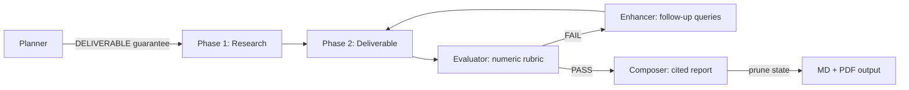

# Deep Research Agent — Project Context

## Agent Instructions

After every feature/fix: run tests → verify live endpoint → update all project docs (AGENTS.md, ARCHITECTURE.md, ROADMAP.md) → semantic commit → push.

Important learnings (MCP patterns, LangGraph patterns, deployment patterns) must be retrofitted into Hermes skills so knowledge doesn't stay siloed in this repo.

## Architecture

LangGraph StateGraph with 4 nodes + 1 subgraph (two-phase execution):

```
planner → researcher → [refinement subgraph] → composer → report
                              │
                    deliverable ─► evaluator ─┤─ pass ──→ exit
                                ▲              └─ fail ──→ enhancer ──┘
                                └─────────────────────────── loop ────┘
```

Parallel fan-out via Send API: planner extracts [RESEARCH] goals → N parallel_researcher nodes (Phase 1) → merge_findings → refinement_subgraph (Phase 2 + critique).

**CLI:** `python -m app.cli --auto "topic"` (auto-approve plan)
**MCP:** `python -m app.mcp_server --transport sse --port 8100`
**Docker:** `docker compose up -d` (includes SearXNG)

## Key Files

| File | Purpose |
|------|---------|
| `app/agent.py` | StateGraph + subgraph + compilation |
| `app/state.py` | ResearchState TypedDict + Pydantic models |
| `app/cli.py` | Interactive CLI with plan review + progress markers + PDF |
| `app/mcp_server.py` | MCP server exposing `deep_research` tool |
| `app/nodes/planner.py` | Plan generation + interrupt + DELIVERABLE guarantee |
| `app/nodes/researcher.py` | Phase 1 research + Phase 2 deliverable (with failsafe) |
| `app/nodes/evaluator.py` | JSON-prompt quality evaluation + score extraction |
| `app/nodes/enhancer.py` | Follow-up search + synthesis |
| `app/nodes/composer.py` | Report synthesis with `<cite>`→ markdown + state pruning |
| `app/tools/search.py` | Tavily → SearXNG → DuckDuckGo fallback |
| `app/tools/citations.py` | URL extraction, tier annotation, tag replacement |
| `app/tokens.py` | Shared LLM factory + token tracking |
| `docker-compose.yml` | Agent + SearXNG deployment |

## Running

```bash
# CLI with plan review
python -m app.cli "Your research topic"

# CLI auto-mode (skip plan review)
python -m app.cli --auto "Your research topic"

# MCP stdio (for Hermes)
python -m app.mcp_server --transport stdio

# Docker + SearXNG
docker compose up -d
hermes mcp add research --url http://localhost:8100/mcp
```

## Environment Variables

| Variable | Default | Description |
|----------|---------|-------------|
| `WORKER_MODEL` | `deepseek-v4-flash` | LLM for research/composition |
| `CRITIC_MODEL` | `deepseek-v4-flash` | LLM for evaluation |
| `WORKER_API_KEY` | — | API key for worker model |
| `WORKER_API_BASE` | — | API base URL |
| `SEARXNG_URL` | `http://localhost:8080` | Self-hosted search |
| `MAX_SEARCH_ITERATIONS` | `3` | Max critique loops |
| `RESEARCH_OUTPUT_DIR` | `~/research` | Report output directory |
| `CHECKPOINT_DB_PATH` | `checkpoints.db` | SQLite checkpoint DB path |

**Multi-model support:** Set `WORKER_MODEL` for research/composition tasks and `CRITIC_MODEL` for evaluation. Use a stronger model for the critic (e.g., Claude Sonnet, GPT-4) to catch subtle quality issues. DeepSeek V4 Flash is the default for both — fast and cost-effective.

## MCP Tools

### `deep_research` — Full research pipeline

```json
{
  "topic": "string (required)",
  "max_iterations": "integer (optional, default 3)"
}
```

Returns markdown report + PDF with citations, saved to `RESEARCH_OUTPUT_DIR`.

### `search` — Quick web search

```json
{
  "query": "string (required)",
  "max_results": "integer (optional, default 5, max 15)"
}
```

Returns markdown-formatted search results with titles, URLs, and snippets.

## Production Features

| Feature | How |
|---------|-----|
| **Progress markers** | Real-time CLI: ✓ per-goal, 📦 Phase 1, 📝 Phase 2, ✅/❌ eval, 🔧 enhancer, 📄 report |
| **State pruning** | Composer caps lists (messages:20, errors:50, scores:5) — prevents O(N²) checkpoint bloat |
| **Circuit breaker** | Score stagnation across 2 iterations → force pass, saves API costs |
| **SQLite checkpointing** | Survives MCP server restarts, zero-config |
| **Graceful save** | Report prints to stdout even if file write fails |
| **DELIVERABLE failsafe** | Prompt mandate + post-processing append + regex failsafe — Phase 2 always executes |
| **Cross-run cache** | Opt-in via `--cache`. Goal-level with aggressive TTL (2d-2wk), delta-validated, date-bound topics never cached |
| **PDF generation** | Automatic pandoc+weasyprint output alongside markdown |
| **Token tracking** | `total_tokens` state field with `operator.add` reducer |
| **Error surface** | Non-fatal errors + evaluation scores in Methodology section |
| **Flexible structure** | Composer uses planner's section outline as primary template |
| **Self-documenting tools** | Rich tool descriptions (HOW IT WORKS, OUTPUT FORMAT, TOPIC GUIDANCE) — no outputSchema (Hermes enforces it on results)

## Quality Pipeline



## Related Skills

Built with patterns now captured in reusable skills:

| Skill | What |
|-------|------|
| `langgraph-agent-patterns` | StateGraph construction, Send API, subgraphs, interrupt/resume, checkpointing, JSON prompting |
| `langgraph-agent-deployment` | MCP server, Docker, SearXNG, health checks, architecture patterns, quality patterns |
| `multi-agent-orchestration` | Send API fan-out, pipeline patterns, circuit breaker, human-in-the-loop |

## Design Notes

Lessons from building and iterating on this agent:

**Architecture is the product.** The two-phase execution model (RESEARCH → DELIVERABLE with critique loop) took three iterations to get right. The first version had a shallow enhancer append, the second lost Phase 2 entirely. Getting the architecture correct — deliverable regeneration inside the refinement loop — was the single highest-leverage decision.

**LLMs need hard constraints, not suggestions.** The planner prompt said "include DELIVERABLE goals" but the LLM ignored it. We needed three layers: prompt mandate, post-processing append, and regex failsafe in the deliverable node. Similarly, the evaluator rubric needs explicit numeric criteria — "be strict" is meaningless to an LLM, "score ≥4 on all three axes" works.

**Cross-run caching has diminishing returns.** We implemented key phrase hashing, fuzzy matching, and delta validation. It works, but hit rate is fundamentally limited by LLM non-determinism. For a single-agent tool doing fresh research, the right default is no cache. `--cache` is a lightweight bonus, not a core feature. Semantic chunking + vector retrieval would add significant complexity for marginal benefit.

**Production reliability comes from research, not intuition.** We used the agent to research LangGraph production patterns, found the O(N²) checkpoint bloat issue, and applied the fix (state pruning). The circuit breaker came from the same research. Using the tool to improve the tool is the defining pattern.

**Stream + invoke is fragile.** LangGraph's `interrupt()` mechanism with `graph.stream()` + `graph.invoke(Command(resume=...))` caused planner double-entry. The fix was eliminating `interrupt()` entirely — a two-pass approach where plan generation happens outside the graph. Simpler, faster, one less LLM call.
