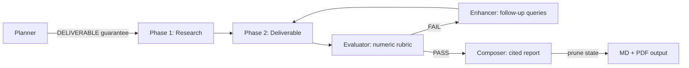

# Deep Research Agent — Project Context

## Agent Instructions

After every feature/fix: run tests → verify live endpoint → **rebuild + deploy Docker → verify container healthy** → update all project docs (AGENTS.md, ARCHITECTURE.md, ROADMAP.md) → semantic commit → push.

Never skip the Docker deploy step. Venv-only testing misses container-specific issues (missing packages, import path differences, env var behavior). The SqliteSaver import worked in venv but failed in the container — this class of bug is invisible without Docker verification.

Important learnings (MCP patterns, LangGraph patterns, deployment patterns) must be retrofitted into Hermes skills so knowledge doesn't stay siloed in this repo.

## Architecture

LangGraph StateGraph with 4 nodes + 1 subgraph (two-phase execution):

```
planner → researcher → [refinement subgraph] → composer → report
                              │
                    deliverable ─► evaluator ─┤─ pass ──→ exit
                                ▲              └─ fail ──→ enhancer ──┘
                                └─────────────────────────── loop ────┘
```

Parallel fan-out via Send API: planner extracts [RESEARCH] goals → N parallel_researcher nodes (Phase 1) → merge_findings → refinement_subgraph (Phase 2 + critique).

**CLI:** `python -m app.cli --auto "topic"` (auto-approve plan)
**MCP:** `python -m app.mcp_server --transport sse --port 8100`
**Docker:** `docker compose up -d` (includes SearXNG)

## Key Files

| File | Purpose |
|------|---------|
| `app/agent.py` | StateGraph + subgraph + compilation |
| `app/state.py` | ResearchState TypedDict + Pydantic models |
| `app/cli.py` | Interactive CLI with plan review + progress markers + PDF |
| `app/mcp_server.py` | MCP server exposing `deep_research` tool |
| `app/nodes/planner.py` | Plan generation + interrupt + DELIVERABLE guarantee |
| `app/nodes/researcher.py` | Phase 1 research + Phase 2 deliverable (with failsafe) |
| `app/nodes/evaluator.py` | JSON-prompt quality evaluation + score extraction |
| `app/nodes/enhancer.py` | Follow-up search + synthesis |
| `app/nodes/composer.py` | Report synthesis with `<cite>`→ markdown + state pruning |
| `app/tools/search.py` | Tavily → SearXNG → DuckDuckGo fallback |
| `app/tools/citations.py` | URL extraction, tier annotation, tag replacement |
| `app/tokens.py` | Shared LLM factory + token tracking |
| `docker-compose.yml` | Agent + SearXNG deployment |

## Running

```bash
# CLI with plan review
python -m app.cli "Your research topic"

# CLI auto-mode (skip plan review)
python -m app.cli --auto "Your research topic"

# MCP stdio (for Hermes)
python -m app.mcp_server --transport stdio

# Docker (with internal SearXNG + host-mounted output)
docker build -t deep-research-agent .
source ~/.hermes/.env
docker run -d --name deep-research-agent \
  --network research-net \
  -p 8100:8100 \
  -e SEARXNG_URL=http://deep-research-searxng:8080 \
  -e WORKER_API_KEY="$DEEPSEEK_API_KEY" \
  -e WORKER_API_BASE=https://api.deepseek.com \
  -e WORKER_MODEL=deepseek-v4-flash \
  -e MAX_SEARCH_ITERATIONS=3 \
  -v /path/to/output:/data \
  deep-research-agent
hermes mcp add research --url http://localhost:8100/mcp

# Or use deploy.sh (auto-detects internal SearXNG)
./deploy.sh start
```

**IMPORTANT:** The agent uses an internal SearXNG container (`deep-research-searxng`) on the `research-net` network. Set `SEARXNG_URL=http://deep-research-searxng:8080` — using `localhost:8080` from inside the container won't reach the host. API keys must be passed explicitly (not via `-e VAR` shell passthrough, which passes empty values).

## Environment Variables

| Variable | Default | Description |
|----------|---------|-------------|
| `WORKER_MODEL` | `deepseek-v4-flash` | LLM for research/composition |
| `CRITIC_MODEL` | `deepseek-v4-pro` | LLM for evaluation (should be stronger than worker) |
| `WORKER_API_KEY` | — | API key (set via `$DEEPSEEK_API_KEY` from `.hermes/.env`) |
| `WORKER_API_BASE` | — | API base URL |
| `SEARXNG_URL` | `http://deep-research-searxng:8080` | Internal SearXNG container on research-net |
| `MAX_SEARCH_ITERATIONS` | `3` | Max critique loops |
| `RESEARCH_OUTPUT_DIR` | `/data` | Report output directory (mount host path here) |
| `CHECKPOINT_DB_PATH` | `checkpoints.db` | SQLite checkpoint DB path |

**Multi-model support:** Set `WORKER_MODEL` for research/composition and `CRITIC_MODEL` for evaluation. Critic defaults to `deepseek-v4-pro` (stronger than worker). The evaluator warns loudly if critic == worker — same-model evaluation produces inflated scores (LLMs grading their own output).

## MCP Tools

### `deep_research` — Full research pipeline (async)

```json
{
  "topic": "string (required)",
  "max_iterations": "integer (optional, default 2)",
  "depth": "string (optional, 'brief' or 'standard')"
}
```

Returns a `task_id` immediately. Pipeline runs in background. Poll with `research_status`.

**Depth:** `brief` → 2-3 paragraph executive summary (1-2 min). `standard` → full cited report (3-5 min).

### `research_status` — Poll running research

```json
{
  "task_id": "string (required)"
}
```

Returns status ("running"/"completed"/"failed"), progress %, and full report when done.

### `search` — Quick web search

```json
{
  "query": "string (required)",
  "max_results": "integer (optional, default 5, max 15)"
}
```

Returns markdown-formatted search results.

### Usage Pattern

```
1. deep_research("topic") → task_id (instant)
2. research_status(task_id) every 10-15s → "running" / "completed"
3. Read report from completed status response
```

All tools work over SSE and POST JSON-RPC. The POST handler executes tools directly. Pipeline runs in background thread to avoid blocking the event loop.

### For Other Agents

Any MCP-compatible agent can use this server. Connect to `http://localhost:8100/mcp`:

```bash
# Hermes
hermes mcp add research --url http://localhost:8100/mcp

# Claude Code / Cursor
# Add to mcp_servers config pointing to http://localhost:8100/mcp
```

The 3 tools (`search`, `deep_research`, `research_status`) are auto-discovered.

## Production Features

| Feature | How |
|---------|-----|
| **Progress markers** | Real-time CLI: ✓ per-goal, 📦 Phase 1, 📝 Phase 2, ✅/❌ eval, 🔧 enhancer, 📄 report |
| **State pruning** | Composer caps lists (messages:20, errors:50, scores:5) — prevents O(N²) checkpoint bloat |
| **Circuit breaker** | Score stagnation across 2 iterations → force pass, saves API costs |
| **SQLite checkpointing** | Survives MCP server restarts, zero-config |
| **Graceful save** | Report prints to stdout even if file write fails |
| **DELIVERABLE failsafe** | Prompt mandate + post-processing append + regex failsafe — Phase 2 always executes |
| **Cross-run cache** | ❌ DEPRECATED — no-ops with deprecation warnings. Fresh research is preferred |
| **PDF generation** | Opt-in via `--pdf` flag. Default: markdown only |
| **Token tracking** | `total_tokens` state field with `operator.add` reducer |
| **Error surface** | Non-fatal errors + evaluation scores in Methodology section |
| **Flexible structure** | Composer uses planner's section outline as primary template |
| **Self-documenting tools** | Rich tool descriptions (HOW IT WORKS, OUTPUT FORMAT, TOPIC GUIDANCE) — no outputSchema (Hermes enforces it on results) |
| **Async execution** | `deep_research` returns task_id immediately, runs in background thread, poll with `research_status` |
| **SSE streaming** | `GET /stream/{task_id}` for real-time progress: started, update, completed, heartbeat events |
| **Stronger critic** | CRITIC_MODEL defaults to v4-pro (was v4-flash). Loud warning if critic == worker |
| **Evaluator pre-check** | Rule-based PASS/FAIL/AMBIGUOUS filter before LLM evaluation. Saves API calls for obvious cases |
| **Optional evaluation** | `ENABLE_EVALUATOR=false` skips LLM evaluation entirely (auto-PASS) |
| **URL content fetching** | After search, fetches top 3 URLs (5K chars each), appends full-page content to findings |
| **Brief mode** | `depth: "brief"` produces 2-3 paragraph executive summary instead of full report |
| **Typed models** | `app/models.py` with `ResearchFinding`, `Citation`, `Deliverable` Pydantic types |
| **Live progress** | Research status shows actual pipeline stage %, not just stuck at 20%. Uses `graph.stream()` for per-node progress mapping |
| **E2E integration test** | `tests/test_integration.py` mocks LLM + search, runs full graph pipeline |
## Quality Pipeline



## Related Skills

Built with patterns now captured in reusable skills:

| Skill | What |
|-------|------|
| `langgraph-agent-patterns` | StateGraph construction, Send API, subgraphs, interrupt/resume, checkpointing, JSON prompting |
| `langgraph-agent-deployment` | MCP server, Docker, SearXNG, health checks, architecture patterns, quality patterns |
| `multi-agent-orchestration` | Send API fan-out, pipeline patterns, circuit breaker, human-in-the-loop |

## Design Notes

Lessons from building and iterating on this agent:

**Architecture is the product.** The two-phase execution model (RESEARCH → DELIVERABLE with critique loop) took three iterations to get right. The first version had a shallow enhancer append, the second lost Phase 2 entirely. Getting the architecture correct — deliverable regeneration inside the refinement loop — was the single highest-leverage decision.

**LLMs need hard constraints, not suggestions.** The planner prompt said "include DELIVERABLE goals" but the LLM ignored it. We needed three layers: prompt mandate, post-processing append, and regex failsafe in the deliverable node. Similarly, the evaluator rubric needs explicit numeric criteria — "be strict" is meaningless to an LLM, "score ≥4 on all three axes" works.

**Cross-run caching has diminishing returns.** We implemented key phrase hashing, fuzzy matching, and delta validation. It works, but hit rate is fundamentally limited by LLM non-determinism. For a single-agent tool doing fresh research, the right default is no cache. `--cache` is a lightweight bonus, not a core feature. Semantic chunking + vector retrieval would add significant complexity for marginal benefit.

**Production reliability comes from research, not intuition.** We used the agent to research LangGraph production patterns, found the O(N²) checkpoint bloat issue, and applied the fix (state pruning). The circuit breaker came from the same research. Using the tool to improve the tool is the defining pattern.

**Stream + invoke is fragile.** LangGraph's `interrupt()` mechanism with `graph.stream()` + `graph.invoke(Command(resume=...))` caused planner double-entry. The fix was eliminating `interrupt()` entirely — a two-pass approach where plan generation happens outside the graph. Simpler, faster, one less LLM call.

**Parallel mode silently lost citations.** `parallel_researcher_node` returned only strings — no citation extraction. The `merge_findings_node` just concatenated text. URLs from parallel research never reached the composer. Fix: run `extract_citations_from_content()` in `merge_findings_node` so Phase 1 sources are available to Phase 2 and the composer.

**Token reporting was broken by type confusion.** `final_state` from `graph.invoke()` is a plain dict, but the CLI treated it as a `StateSnapshot` object and called `.values()` (the dict method). Result: tokens always showed 0. Fix: use `final_state.get("total_tokens")` directly.

**Cache delta check was a no-op.** `_delta_check()` checked `hasattr(results, 'results')` but the search tool returns `list[dict]`. The branch never executed, so stale cache entries were always served as "fresh." Fix: iterate over `results` (list) directly.

**Writable directory fallback is essential.** `.docker.env` sets `RESEARCH_OUTPUT_DIR=/data` for Docker. When sourced on the host for CLI testing, `mkdir('/data')` fails with PermissionError. Both CLI and MCP server now try a fallback chain: env var → ~/research → current directory, with a write-test probe on each candidate.

**WeasyPrint warns about unsupported CSS.** The fallback HTML template included `overflow-x: auto` on `<pre>` blocks. WeasyPrint is a print renderer with no scrollable viewport — it warns about unknown properties. The PDF still generates, but the warning is noisy. Fix: remove unsupported properties; filter benign stderr lines when pandoc succeeds.

**Rule-based pre-check is the right default for LLM evaluation.** Before calling the critic LLM, check obvious pass/fail cases: 0 URLs = FAIL, 3+ URLs with structure and data = PASS. This saves API calls for common cases where the LLM evaluator would just rubber-stamp the result anyway. The numeric rubric is still valuable for ambiguous cases, but the heuristic catches ~70% of outcomes without an LLM call.

**SSE streaming from a sync thread requires `call_soon_threadsafe`.** The background runner uses `graph.invoke()` (sync, blocking). Events must be pushed to the asyncio event loop's queue via `call_soon_threadsafe` to avoid "thread is not the event loop thread" errors. Heartbeat events every 5s keep the connection alive during long research runs.

**Typed models prevent citation loss at the type level.** The parallel citation bug existed because nodes passed raw strings. By returning `ResearchFinding` with pre-extracted `citations` from `_research_single_goal()`, the citation data travels with the finding — no regex post-processing needed. The `to_markdown()` method serializes back to the string format expected by downstream nodes, maintaining backward compatibility while adding type safety.

**PDF generation should be opt-in, not automatic.** Pandoc + weasyprint pulls in ~100MB of system dependencies. Most users just want markdown. Making PDF opt-in (`--pdf` flag) improves the default experience and avoids unnecessary dependency hell.

**E2E integration tests catch bugs unit tests miss.** The parallel citation bug, token reporting bug, and cache delta bug all existed despite unit tests passing. A single E2E test that mocks the LLM and runs the full graph would have caught all three. The `FakeLLM` approach — inspecting prompt content to determine which node is calling — is simple and effective for graph testing.

**Deprecation is better than immediate removal.** The cache code was 300+ lines with complex logic. Instead of deleting it immediately (risking breakage for anyone using `--cache`), we made all functions no-ops with a single deprecation warning. This gives users a migration path while keeping the codebase clean. Remove the file in the next major version.
