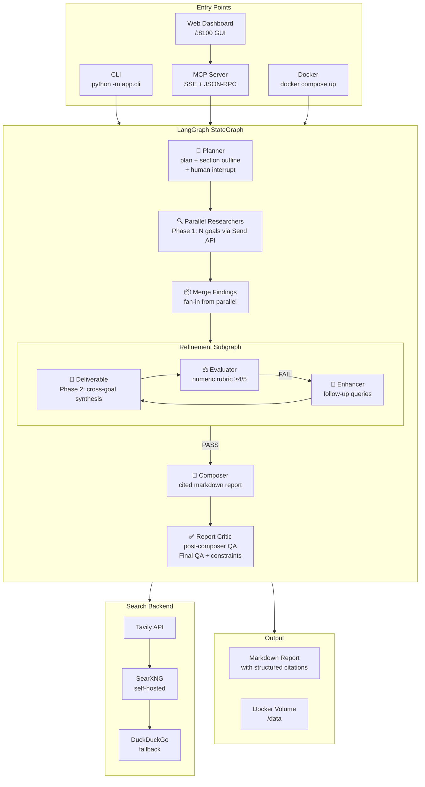
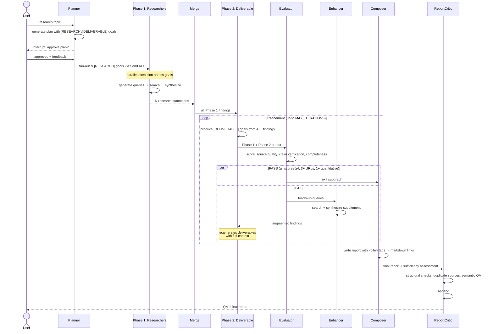
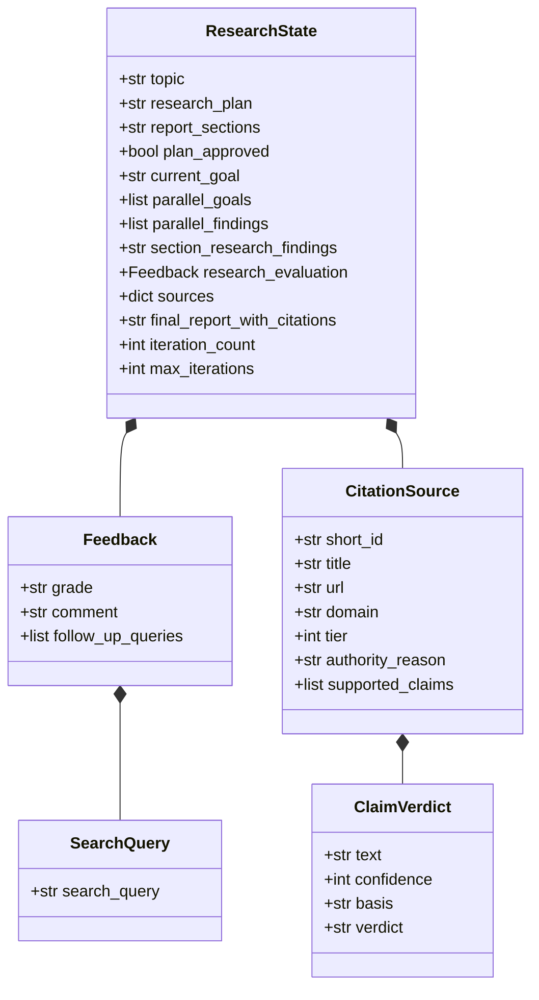
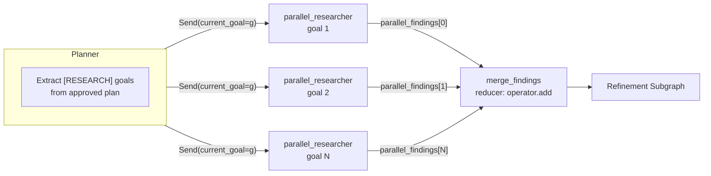
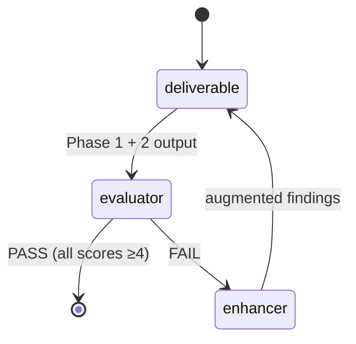
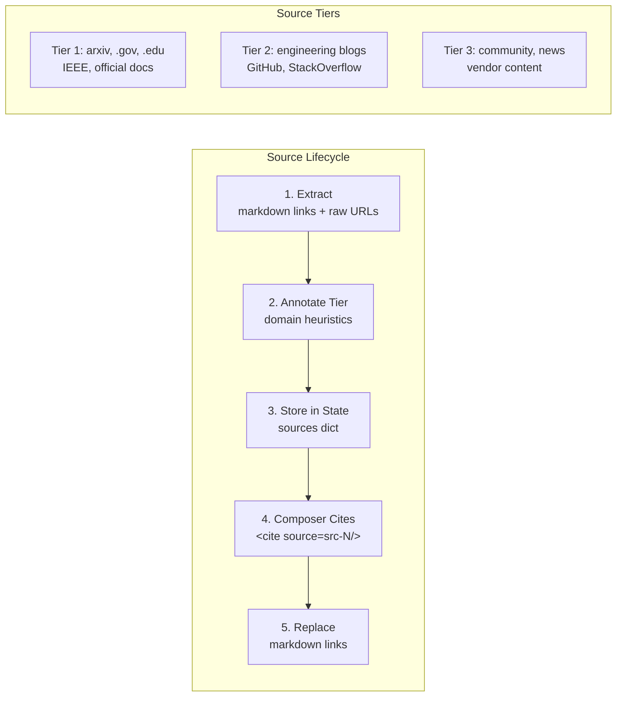
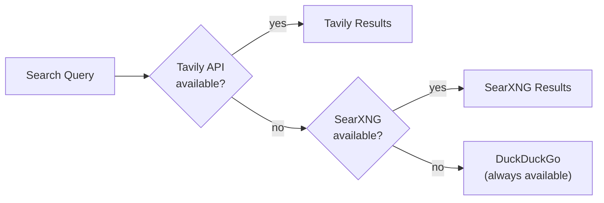
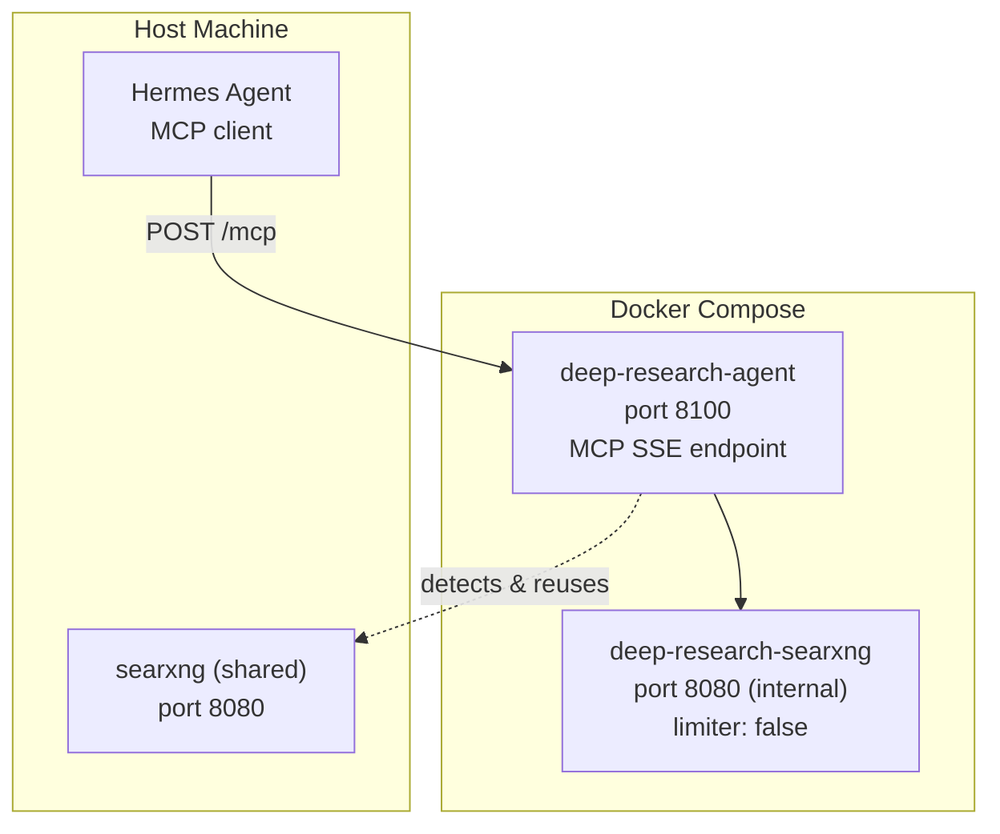
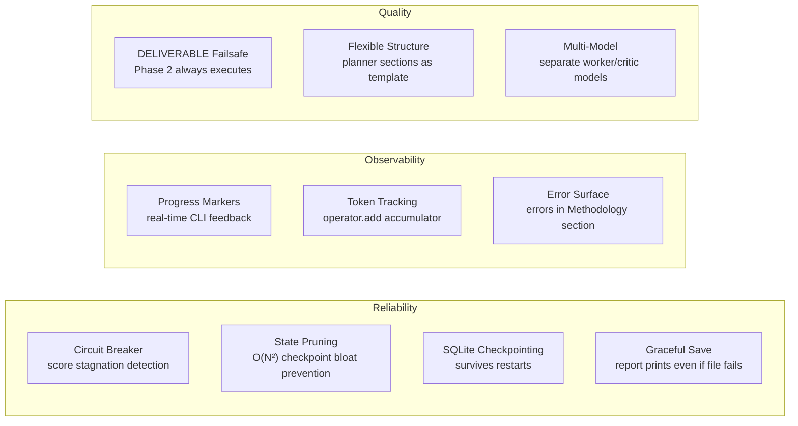
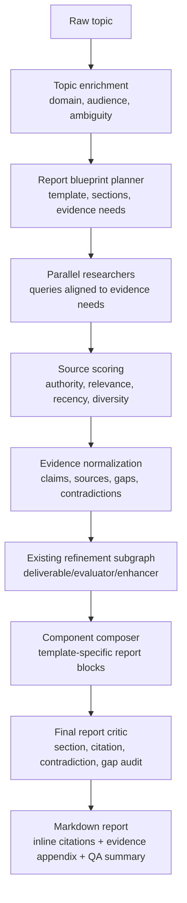

# Architecture: Deep Research Agent

LangGraph-based deep research agent combining Google ADK's two-phase execution model with LangGraph's native parallelism. MCP server for external integration, Docker-deployable.

## High-Level Architecture



## Two-Phase Execution Model



## State Design



## Parallel Fan-Out (Send API)



Each `parallel_researcher` runs Phase 1 only for one goal: generate 4-5 search queries → execute all → synthesize summary with [CONFIDENCE:N] tags and [T1/T2/T3] source tiers.

## Refinement Subgraph Detail



| Node | Role | Key Behavior |
|------|------|-------------|
| **deliverable** | Phase 2 synthesis | Produces [DELIVERABLE] goals from ALL Phase 1 findings. No new searches — synthesis only. Strips previous deliverables on re-run to avoid duplication. |
| **evaluator** | Quality gate | **Rule-based pre-check** (CLEAR PASS/FAIL/AMBIGUOUS) skips LLM for obvious cases. Numeric rubric: source quality (1-5), claim verification (1-5), completeness (1-5). PASS requires all ≥4 + 3+ URL citations + 1+ quantitative finding. `ENABLE_EVALUATOR=false` auto-PASS. |
| **enhancer** | Follow-up research | Runs evaluator's follow_up_queries, synthesizes supplement, appends to findings. Does NOT bypass deliverable — findings feed back through deliverable for full Phase 2 regeneration. |

## Citation System



## Per-Claim Confidence Scale

| Level | Meaning | Composer Treatment |
|-------|---------|-------------------|
| 5 | Direct measurement, primary source | Stated as fact |
| 4 | Multiple authoritative sources agree | Stated as fact |
| 3 | Reasonable inference | "Evidence suggests..." |
| 2 | Weakly sourced, speculative | "Preliminary data indicates..." |
| 1 | Educated guess | "One possible interpretation..." |

## Search Backend Fallback



Configured via environment: `TAVILY_API_KEY`, `SEARXNG_URL`. Falls back gracefully — no crash if a backend is unavailable.

## Deployment



`deploy.sh start` auto-detects existing SearXNG on port 8080 (shared with Hermes) or creates a dedicated internal SearXNG with `limiter: false` to avoid 403 bot detection.

## Key Design Decisions

| Decision | Rationale |
|----------|-----------|
| **JSON prompting over `with_structured_output`** | DeepSeek V4 does not support `response_format`. Evaluator uses manual JSON parsing with graceful degradation. |
| **Send API for fan-out** | LangGraph's official pattern for parallel execution. Avoids external process management (old Hermes chat spawning). |
| **Deliverable inside refinement loop** | Enhancer findings must flow through Phase 2 for full regeneration — not shallow append. |
| **Dedicated SearXNG with `limiter: false`** | Shared Hermes SearXNG has rate limiting enabled. Research agent needs unlimited access. Set `SEARXNG_URL=http://deep-research-searxng:8080` (internal container on research-net). `localhost:8080` fails from inside the container — it resolves to the container itself, not the host. |
| **MCP POST JSON-RPC handler** | Hermes probes MCP via POST, not just SSE. Full `initialize` / `tools/list` dispatch. `tools/call` executes tools directly (no stub redirect). Progress notifications degrade silently on POST (no SSE context). Embedded resource URIs are stringified for JSON serialization (Pydantic `AnyUrl`). |
| **MCP tool descriptions** | Rich self-documenting descriptions (HOW IT WORKS, OUTPUT FORMAT, TOPIC GUIDANCE) with examples. `outputSchema` removed — Hermes MCP client enforces it on results and our tools return markdown text, not structured JSON. |
| **Health check ≥30s** | Long research runs exceed default 5s Docker health check. Prevents flapping. |
| **State pruning on report** | Composer caps accumulator lists (messages: 20, errors: 50, evaluation_scores: 5) to prevent O(N²) checkpoint bloat. Finding: 200-turn agent → 5.3 GB checkpoints without pruning. |
| **DELIVERABLE failsafe** | Planner prompt mandates 1-2 DELIVERABLE goals. Post-processing appends default if none generated. Deliverable node has string-match failsafe when regex misses the tag. Phase 2 guaranteed to execute. |
| **Circuit breaker** | Evaluator loop detects score stagnation across 2 iterations. If total score doesn't improve, forces pass with downgraded recommendation to avoid wasted enhancer cycles. |
| **Async background execution** | `deep_research` returns task_id immediately (<1s). Pipeline runs in background thread (sync `graph.invoke()` blocks asyncio event loop). Client polls `research_status` every 10-15s. In-memory task cache prunes entries older than 24 hours, while persisted completed-task metadata is rehydrated on restart for dashboard history. |
| **PRR assessment** | Production Readiness Review replaces letter grades. 5 dimensions (monitoring, incident response, security, scalability, operability) with concrete pass/fail items. See ROADMAP.md. |
| **Topic enrichment** | Raw topic → structured research brief (domain, ambiguities, output format, key dimensions). One cheap LLM call before planning prevents entire research runs going in the wrong direction. Skips on feedback/refinement cycles. |
| **Report blueprint** | Structured report template with required sections and decision artifacts propagated from planner through composer. Template-specific block configs (retail_investor_memo, decision_memo, architecture_review, etc.). |
| **Sufficiency assessment** | Evaluator checks whether remaining evidence gaps block the final recommendation. Produces `information_sufficient`, `blocking_gaps`, `recommendation_strength`, and targeted `follow_up_queries`. Stagnation detection downgrades to `no_recommendation` when scores plateau. |
| **Contradiction detection** | Compares high-confidence claims (confidence ≥ 4) from different sources using 7 polarity pairs. Requires ≥ 3 shared topic words. Blocking contradictions become gaps that trigger re-research. |
| **Source diversity scoring** | Counts unique domains across sources. Normalizes www/ports. Returns low/medium/high. Non-blocking — informational in Final QA. |
| **Report critic** | Post-composer QA gate: structural checks (sections, artifacts, inline citations), duplicate source detection (same URL under different src-IDs), semantic QA via dedicated LLM call (unsupported quantitative claims, mechanism misattributions, empty tables). Appends `## Final QA` and `## Recommendation Constraints`. |
| **Claim extraction** | Two-pass composer extraction: primary scans `<cite src="N"/>` and `[src-N]` tags, fallback scans inline markdown links `[text](url)` when primary yields <3 claims. Sanitizes claim text (strips cite tags, markdown headers, bullet markers). |
| **Evidence gap filtering** | Regex-based gap extraction in enhancer and merge_findings excludes 8 meta-commentary patterns ("search results", "original evaluation", "previously missing", "deficiencies identified", "synthesis incorporates", "impact on previous findings", "addressed in", "filling missing") that leak from refinement passes. |
| **Source deduplication** | Composer deduplicates the source register by URL before rendering. Builds citation ID remapping so report body references stay consistent. Eliminates the 17-40 duplicate entries previously flagged by the critic. |
| **Empty table suppression** | Composer omits Major Claims and Missing Evidence sections entirely when their data lists are empty, rather than rendering header-only tables. |
| **Critic model check** | Report critic warns when CRITIC_MODEL equals WORKER_MODEL to prevent inflated QA scores from same-model evaluation. |
| **Verification pass** | After Phase 1 synthesis, detects domain-specific keywords (manufacturing, defense, etc.) and runs cross-check search with disambiguators (\"software engineering\"). Appends Verification Note if alternative context found. Only triggers when concerning terms detected — zero cost otherwise. |
| **Writable directory fallback** | CLI and MCP server try RESEARCH_OUTPUT_DIR → ~/research → cwd with write-test probe. Prevents PermissionError when .docker.env (with /data) is sourced on host. |
| **LLM timeout/retry** | `ChatOpenAI` configured with `timeout=60` and `max_retries=2` to handle transient API failures gracefully. |
| **Web dashboard** | Served at `/` — single self-contained HTML page. Zero new dependencies (Starlette already handles HTTP). Auto-refreshes via 5s polling of `/tasks` JSON API. Inline report viewer uses modal overlay (no popup blockers). Launch form POSTs to existing MCP `tools/call` endpoint — no new backend code. PDF checkbox + `⬇ PDF` download link for reports with PDFs. Dashboard task history now merges in-memory tasks with persisted `task_*.json` metadata, so completed tasks survive restart. Elapsed timer freezes on completion and displays minutes instead of seconds. Dashboard, `/tasks`, `/stream/{task_id}`, and `/download/{filename}` are local/private-network only by default; set `DASHBOARD_PUBLIC=1` to expose them remotely. `/tasks` returns sanitized filenames only — no absolute report paths. |
| **Stage labels** | `research_status` now returns human-readable pipeline stage (e.g. "Searching the web (Phase 1)") alongside numeric progress. Stage data already available internally from `graph.stream()` per-node mapping — just wasn't surfaced to MCP clients. Added `STAGE_LABELS` dict mapping internal node names to user-facing descriptions. |
| **Concurrent execution** | Multiple `deep_research` calls spawn separate OS threads via `asyncio.to_thread`. Each task gets a unique `task_id` (used as LangGraph `thread_id` for checkpoint isolation) and unique report filename (`task_id[-12:]` suffix). SQLite connection uses `check_same_thread=False` (WAL mode). Three concurrency bugs found and fixed: global `os.environ` race, `int(time.time())` thread_id collision, same-second report filename collision. |
| **PDF generation** | Opt-in via MCP `pdf: true` or dashboard checkbox. Calls `_convert_to_pdf()` from CLI module (pandoc + weasyprint) after saving `.md`. Served via `/download/{filename}` route with path traversal protection. PDF adds ~5-10s to research completion. |
| **Checkpoint persistence** | Checkpoints stored in named Docker volume (`research_checkpoints:/app/checkpoints`) with `CHECKPOINT_DB_PATH` env var. Survives container recreation and deploys — previously lost on every redeploy. `docker-compose.yml` now matches `deploy.sh` here instead of drifting behind it. |
| **SearXNG version pin** | Pinned to `2026.6.2-e964708c0` in both `deploy.sh` and `docker-compose.yml` (was `:latest`). Prevents silent breakage from upstream SearXNG releases. |
| **Language-aware search** | Three-layer fix for jurisdiction-specific topics. Enrichment detects country/language (e.g., "Spanish immigration law → search in Spanish"). Planner annotates RESEARCH goals with `(search in LANGUAGE; sources: domain1, domain2)`. Researcher regex extracts language, forces query generation in target language, and passes the language hint into the search backend. SearXNG uses the requested language, Tavily routes non-English searches through SearXNG when available, and DDGS fallback maps hints to locale-specific regions. |
| **Error page detection** | `_is_error_page()` detects 404/403/500 pages in Spanish, English, German, Japanese (language-agnostic keyword matching + short-boilerplate heuristic). In `fetch_url_content`: HTTP error pages force browser fallback even when >500 chars. In `_fetch_via_browser`: error pages trigger domain-root navigation + link-following from root. Root-fallback failure returns empty (prevents synthesizing from error page content). Link-following depth increased from 2→3 in fetch_url_content, 1→2 in researcher. |
| **Readiness endpoint** | `/ready` adds deep operational checks beyond `/health`: config presence, report-dir writability, checkpoint DB openability, authenticated LLM endpoint reachability, and a real low-cost probe of the active search backend. `/health` stays a cheap liveness check. |
| **HTTP/MCP route tests** | `tests/test_mcp_server.py` verifies POST `/mcp` initialize/tools-list, persisted `/tasks`, `/ready`, `/download` path traversal blocking, local/private-network dashboard gating, spoofed header rejection, `/stream/{task_id}` terminal events, and dashboard load. |

## Production Features



### Progress Markers

Real-time CLI feedback at every milestone. All `flush=True` for immediate output:

| Marker | When | Example |
|--------|------|---------|
| `✓` | Per-goal research complete | `✓ [Analyze performance...] (10,726 chars)` |
| `📦` | Phase 1 merge | `📦 Phase 1 complete — 3 goals, 30,575 chars` |
| `📝` | Phase 2 deliverables | `📝 Phase 2: 2 deliverables from 30,575 chars` |
| `✅/❌` | Evaluation result | `✅ PASS (5/5, 4/5, 5/5)` or `❌ FAIL (3/5, 3/5, 4/5)` |
| `🔧` | Enhancer cycle | `🔧 Enhanced — iteration 1 (7 queries)` |
| `📄` | Report generated | `📄 Report generated — 43,459 chars` |

### State Pruning

Composer caps accumulator lists to prevent quadratic checkpoint growth:

| Field | Cap | Rationale |
|-------|-----|-----------|
| `messages` | 20 | Last N messages sufficient for debugging |
| `errors` | 50 | Accumulated across iterations |
| `evaluation_scores` | 5 | Only last 2 needed for circuit breaker |
| `parallel_findings` | 20 | Already merged into section_research_findings |

### Token Tracking

`total_tokens: Annotated[int, operator.add]` state field accumulates token usage across all LLM calls. Shared `get_llm()` in `app/tokens.py` provides single factory for all nodes. CLI reports total on completion. Infrastructure in place — per-node tracking is mechanical follow-up.

### Multi-Model Support

Separate models for research (worker) and evaluation (critic) via environment:

| Variable | Default | Role |
|----------|---------|------|
| `WORKER_MODEL` | `deepseek-v4-flash` | Research, composition, deliverables |
| `CRITIC_MODEL` | `deepseek-v4-pro` | Quality evaluation (stronger than worker) |

Use a stronger model for critic to catch subtle quality issues. DeepSeek V4 Pro is the default critic — slower but more accurate than Flash. Same-model evaluation (Flash grading Flash) produces inflated scores.

### Cross-Run Cache

❌ **DEPRECATED** (May 2026). The cross-run cache was 300+ lines with TTL, delta checks, date detection, and fuzzy matching. Hit rate was fundamentally limited by LLM non-determinism (planner generates different goal wordings each run). All cache functions in `app/cache.py` are now no-ops with a single deprecation warning. The `--cache` CLI flag has been removed.

**Lesson:** For single-agent research tools, fresh research with fast models (v4-flash) is cheap enough that caching is not worth the code complexity. Semantic chunking + vector retrieval would add significant complexity for marginal benefit.

### MCP Streaming

SSE endpoint `/stream/{task_id}` provides real-time research progress to MCP clients:

| Event | Payload |
|-------|---------|
| `started` | `{stage, goal_count}` |
| `update` | `{stage, progress, message}` |
| `completed` | `{progress: 100, report_length}` |
| `failed` | `{error}` |
| `heartbeat` | `{}` (every 5s) |

Thread-safe: the background runner pushes events via `_main_event_loop` (stored at server startup). `asyncio.get_event_loop()` fails in background threads on Python 3.12+. Queue auto-creates per task_id and cleans up on completion.

### Evaluator Pre-Check

Before calling the critic LLM, a rule-based pre-check catches obvious pass/fail cases:

| Category | Criteria | Action |
|----------|----------|--------|
| CLEAR FAIL | 0 URLs, <200 chars, error keywords | Return FAIL, skip LLM |
| CLEAR PASS | 3+ URLs, quantitative data, structure, >400 chars | Return PASS, skip LLM |
| AMBIGUOUS | Everything else | Fall through to LLM evaluation |

Saves API calls and latency for common cases. When `ENABLE_EVALUATOR=false`, all evaluations auto-PASS.


## Target Architecture — Evidence-Structured Reports

The next major improvement is not a new agent framework. It is a clearer separation between planning, evidence, composition, and QA.



### New core objects

| Object | Stored in | Purpose |
|---|---|---|
| `ReportBlueprint` | `state.report_blueprint` | Audience, decision context, template, sections, required tables/scenarios/artifacts, source requirements |
| `EvidenceSource` | canonical `state.sources` register | Source metadata, authority tier, source type, claim coverage. Existing `Citation` / `CitationSource` wrappers remain boundary adapters during migration. |
| `EvidenceClaim` | `state.evidence_claims` | Major claims with confidence and supporting/contradicting sources |
| `EvidenceGap` | `state.evidence_gaps` | Missing evidence, why it matters, attempted queries, impact on conclusion |
| `Contradiction` | `state.contradictions` | Conflicting claims and resolution status |
| `ReportCriticResult` | `state.report_critic_result` | Final rendered-report QA verdict and fix list |

### Template families

| Template | When selected | Required blocks |
|---|---|---|
| `generic_research_report` | Default fallback | summary, body sections, themes, gaps, source quality, methodology |
| `decision_memo` | Should we choose/build/adopt? | decision context, options, criteria, scenarios, recommendation |
| `retail_investor_memo` | IPO/stock/investment question for retail audience | what is being offered, business economics, valuation scenarios, retail risks, checklist, recommendation |
| `architecture_review` | System/agent/platform architecture question | current state, alternatives, tradeoffs, roadmap, implementation risks |
| `compare_and_recommend` | Compare/rank/select questions | comparison matrix, scoring rationale, recommendation, caveats |
| `legal_policy_brief` | Law/regulation/jurisdiction-specific question | question presented, authority hierarchy, controlling sources, ambiguity, practical answer |

### Why this architecture

- It preserves the existing LangGraph/MCP runtime.
- It makes report UX better without requiring more agents.
- It gives the critic structured expectations to audit against.
- It improves traceability: report prose is generated from an explicit evidence model.
- It keeps markdown as canonical output while allowing better PDF/dashboard rendering later.

### Deliberate constraints

- `report_sections` remains for backward compatibility during migration.
- Source IDs are allocated only at merge/global source-register boundaries using `url_to_short_id`; parallel workers must not define global IDs.
- First claim/evidence extraction pass is deterministic; no LLM claim extractor until needed.
- Final critic audits the report first; it does not automatically regenerate in v1.
- Evidence appendix is standard-depth only; brief reports stay short.

## File Map

```
deep-research-langgraph/
├── app/
│   ├── agent.py              # StateGraph + subgraph + compilation
│   ├── state.py              # ResearchState TypedDict + Pydantic models
│   ├── models.py             # Typed Pydantic models for node outputs
│   ├── config.py             # Env-based configuration dataclass
│   ├── cli.py                # Interactive CLI with plan review + PDF opt-in
│   ├── mcp_server.py         # MCP SSE/stdio + JSON-RPC POST + SSE streaming
│   ├── tokens.py             # Shared LLM factory + token tracking
│   ├── cache.py              # **DEPRECATED** — no-ops with deprecation warnings
│   ├── nodes/
│   │   ├── planner.py        # Plan generation (two-pass, no interrupt)
│   │   ├── researcher.py     # Phase 1 research + Phase 2 deliverable
│   │   ├── evaluator.py      # Rule-based pre-check + LLM numeric rubric
│   │   ├── enhancer.py       # Follow-up search + synthesis
│   │   └── composer.py       # Report with structured citations
│   └── tools/
│       ├── search.py         # Tavily → SearXNG → DuckDuckGo fallback
│       └── citations.py      # URL extraction, tier annotation, tag replacement
├── tests/
│   ├── test_agent.py         # unit tests for config, evaluator, citations, models, search
│   ├── test_integration.py   # E2E graph scenarios (happy path, enhancer loop, circuit breaker, brief mode)
│   └── test_mcp_server.py    # HTTP/MCP route coverage for dashboard, readiness, tasks, download, stream
├── Dockerfile
├── docker-compose.yml
├── deploy.sh                 # One-command deploy with SearXNG detection
├── searxng-config/
│   └── settings.yml          # limiter: false for internal SearXNG
├── .docker.env.template      # Environment template (keys gitignored)
├── AGENTS.md                 # Quick reference
├── ARCHITECTURE.md           # This document
├── ROADMAP.md                # Technical debt + future features
└── README.md
```

| **Contradiction detection fix** | Moved from evaluator (Phase 1) to report critic (Phase 2 post-composition). The evaluator ran before evidence_claims were extracted by the composer — detector was scanning an empty list. Now runs after claim extraction with real data. First confirmed fire: 5 contradictions detected on Vitamin D / COVID-19 topic. |
