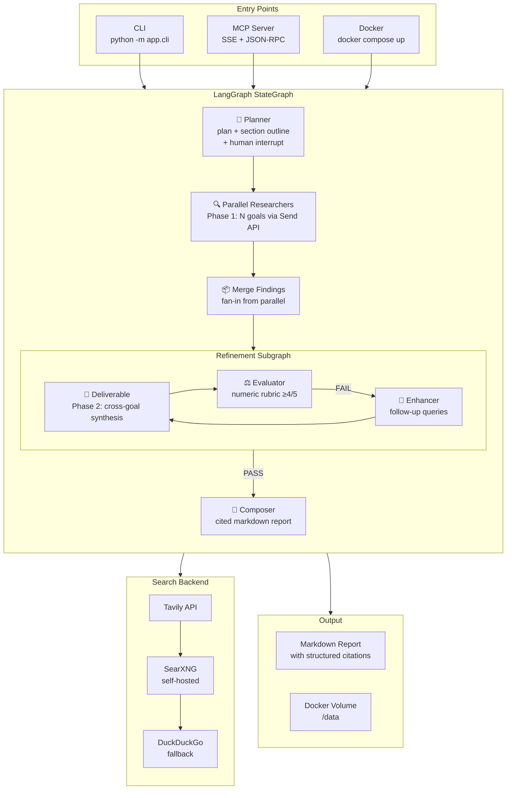
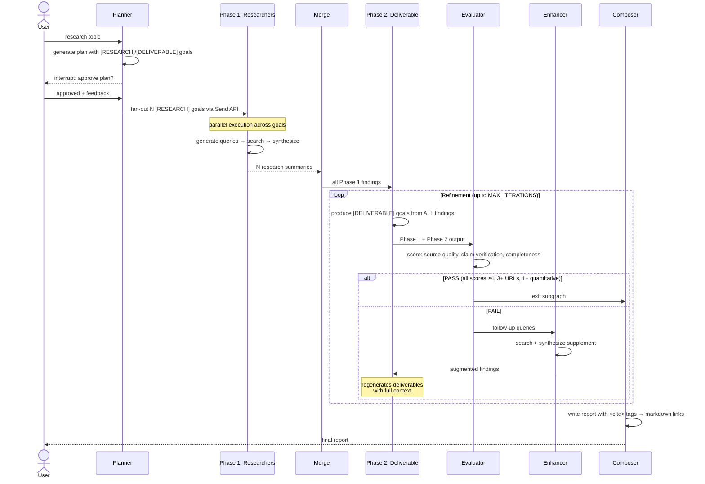
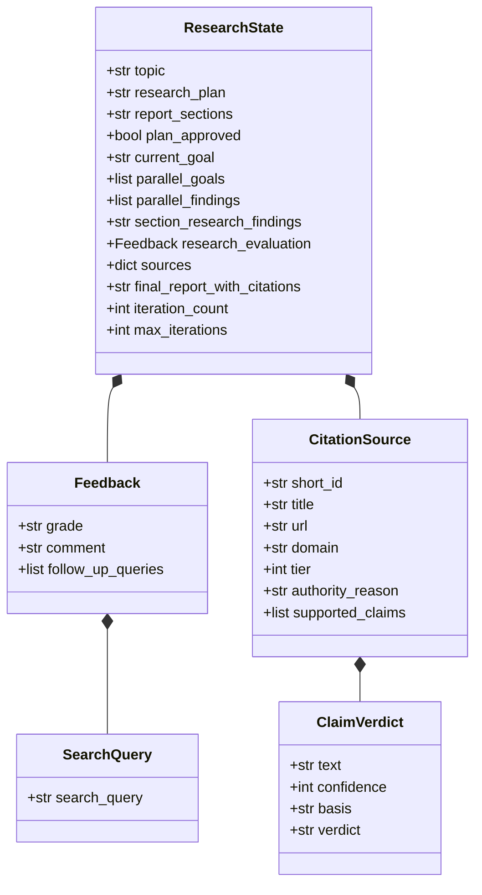
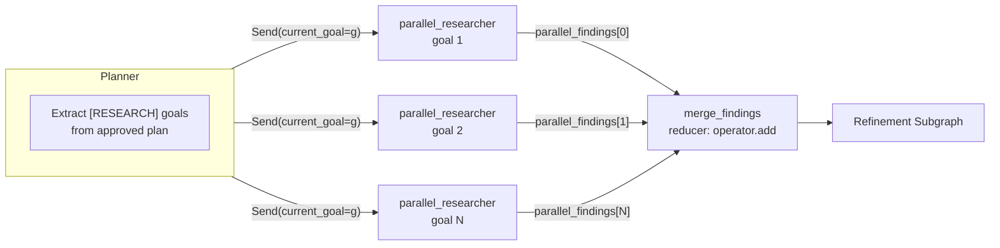
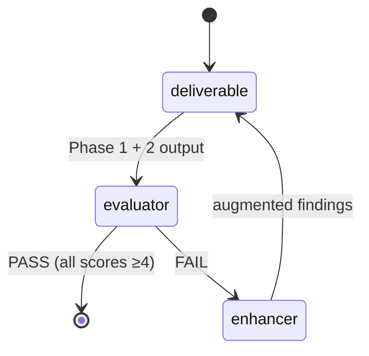
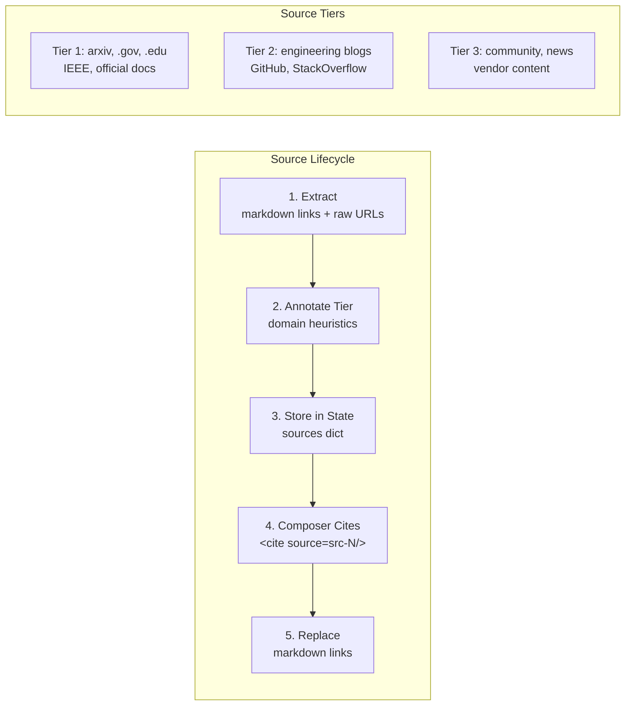
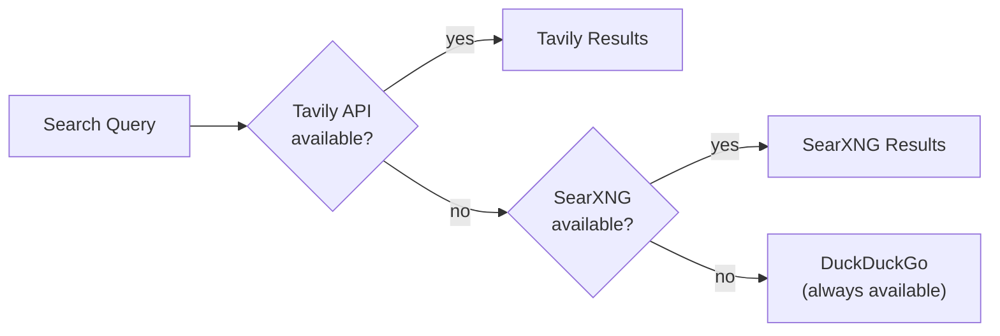
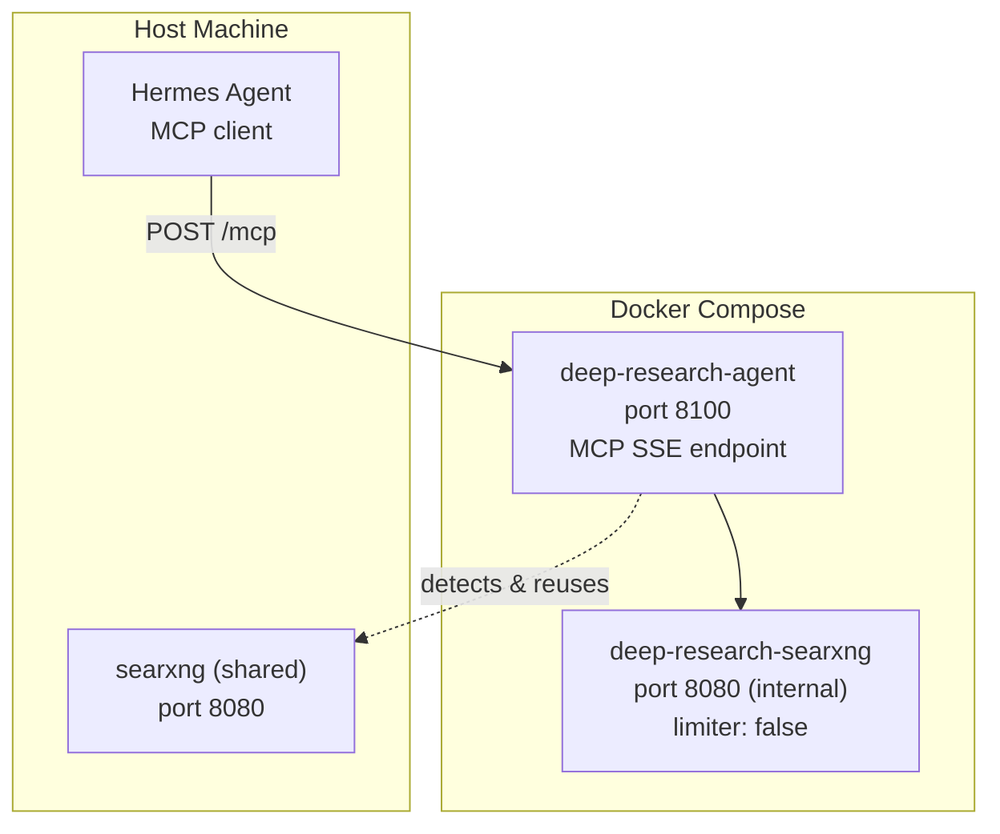
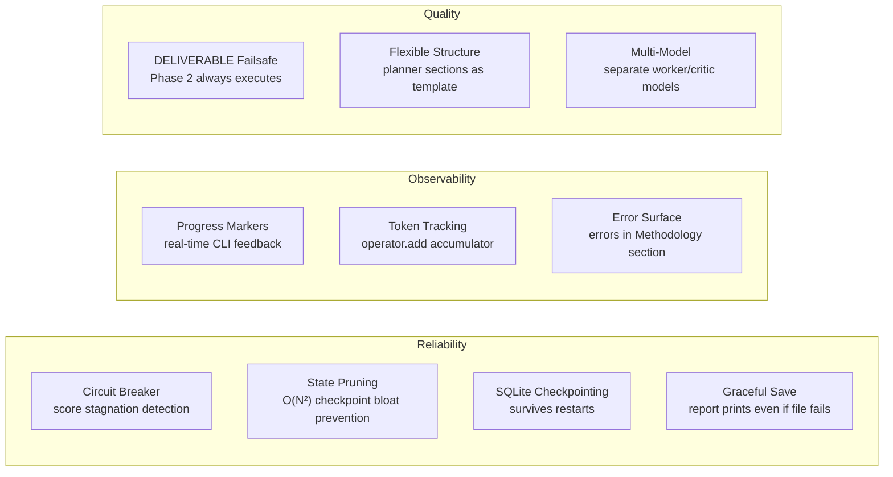

# Architecture: Deep Research Agent

LangGraph-based deep research agent combining Google ADK's two-phase execution model with LangGraph's native parallelism. MCP server for external integration, Docker-deployable.

## High-Level Architecture



## Two-Phase Execution Model



## State Design



## Parallel Fan-Out (Send API)



Each `parallel_researcher` runs Phase 1 only for one goal: generate 4-5 search queries → execute all → synthesize summary with [CONFIDENCE:N] tags and [T1/T2/T3] source tiers.

## Refinement Subgraph Detail



| Node | Role | Key Behavior |
|------|------|-------------|
| **deliverable** | Phase 2 synthesis | Produces [DELIVERABLE] goals from ALL Phase 1 findings. No new searches — synthesis only. Strips previous deliverables on re-run to avoid duplication. |
| **evaluator** | Quality gate | **Rule-based pre-check** (CLEAR PASS/FAIL/AMBIGUOUS) skips LLM for obvious cases. Numeric rubric: source quality (1-5), claim verification (1-5), completeness (1-5). PASS requires all ≥4 + 3+ URL citations + 1+ quantitative finding. `ENABLE_EVALUATOR=false` auto-PASS. |
| **enhancer** | Follow-up research | Runs evaluator's follow_up_queries, synthesizes supplement, appends to findings. Does NOT bypass deliverable — findings feed back through deliverable for full Phase 2 regeneration. |

## Citation System



## Per-Claim Confidence Scale

| Level | Meaning | Composer Treatment |
|-------|---------|-------------------|
| 5 | Direct measurement, primary source | Stated as fact |
| 4 | Multiple authoritative sources agree | Stated as fact |
| 3 | Reasonable inference | "Evidence suggests..." |
| 2 | Weakly sourced, speculative | "Preliminary data indicates..." |
| 1 | Educated guess | "One possible interpretation..." |

## Search Backend Fallback



Configured via environment: `TAVILY_API_KEY`, `SEARXNG_URL`. Falls back gracefully — no crash if a backend is unavailable.

## Deployment



`deploy.sh start` auto-detects existing SearXNG on port 8080 (shared with Hermes) or creates a dedicated internal SearXNG with `limiter: false` to avoid 403 bot detection.

## Key Design Decisions

| Decision | Rationale |
|----------|-----------|
| **JSON prompting over `with_structured_output`** | DeepSeek V4 does not support `response_format`. Evaluator uses manual JSON parsing with graceful degradation. |
| **Send API for fan-out** | LangGraph's official pattern for parallel execution. Avoids external process management (old Hermes chat spawning). |
| **Deliverable inside refinement loop** | Enhancer findings must flow through Phase 2 for full regeneration — not shallow append. |
| **Dedicated SearXNG with `limiter: false`** | Shared Hermes SearXNG has rate limiting enabled. Research agent needs unlimited access. Set `SEARXNG_URL=http://deep-research-searxng:8080` (internal container on research-net). `localhost:8080` fails from inside the container — it resolves to the container itself, not the host. |
| **MCP POST JSON-RPC handler** | Hermes probes MCP via POST, not just SSE. Full `initialize` / `tools/list` dispatch. `tools/call` executes tools directly (no stub redirect). Progress notifications degrade silently on POST (no SSE context). Embedded resource URIs are stringified for JSON serialization (Pydantic `AnyUrl`). |
| **MCP tool descriptions** | Rich self-documenting descriptions (HOW IT WORKS, OUTPUT FORMAT, TOPIC GUIDANCE) with examples. `outputSchema` removed — Hermes MCP client enforces it on results and our tools return markdown text, not structured JSON. |
| **Health check ≥30s** | Long research runs exceed default 5s Docker health check. Prevents flapping. |
| **State pruning on report** | Composer caps accumulator lists (messages: 20, errors: 50, evaluation_scores: 5) to prevent O(N²) checkpoint bloat. Finding: 200-turn agent → 5.3 GB checkpoints without pruning. |
| **DELIVERABLE failsafe** | Planner prompt mandates 1-2 DELIVERABLE goals. Post-processing appends default if none generated. Deliverable node has string-match failsafe when regex misses the tag. Phase 2 guaranteed to execute. |
| **Circuit breaker** | Evaluator loop detects score stagnation across 2 iterations. If total score doesn't improve, forces pass to avoid wasted enhancer cycles. Scores parsed from evaluator comments for stagnation detection. |
| **Async background execution** | `deep_research` returns task_id immediately (<1s). Pipeline runs in background thread (sync `graph.invoke()` blocks asyncio event loop). Client polls `research_status` every 10-15s. 1-hour TTL on stored tasks. |
| **Writable directory fallback** | CLI and MCP server try RESEARCH_OUTPUT_DIR → ~/research → cwd with write-test probe. Prevents PermissionError when .docker.env (with /data) is sourced on host. |
| **LLM timeout/retry** | `ChatOpenAI` configured with `timeout=60` and `max_retries=2` to handle transient API failures gracefully. |

## Production Features



### Progress Markers

Real-time CLI feedback at every milestone. All `flush=True` for immediate output:

| Marker | When | Example |
|--------|------|---------|
| `✓` | Per-goal research complete | `✓ [Analyze performance...] (10,726 chars)` |
| `📦` | Phase 1 merge | `📦 Phase 1 complete — 3 goals, 30,575 chars` |
| `📝` | Phase 2 deliverables | `📝 Phase 2: 2 deliverables from 30,575 chars` |
| `✅/❌` | Evaluation result | `✅ PASS (5/5, 4/5, 5/5)` or `❌ FAIL (3/5, 3/5, 4/5)` |
| `🔧` | Enhancer cycle | `🔧 Enhanced — iteration 1 (7 queries)` |
| `📄` | Report generated | `📄 Report generated — 43,459 chars` |

### State Pruning

Composer caps accumulator lists to prevent quadratic checkpoint growth:

| Field | Cap | Rationale |
|-------|-----|-----------|
| `messages` | 20 | Last N messages sufficient for debugging |
| `errors` | 50 | Accumulated across iterations |
| `evaluation_scores` | 5 | Only last 2 needed for circuit breaker |
| `parallel_findings` | 20 | Already merged into section_research_findings |

### Token Tracking

`total_tokens: Annotated[int, operator.add]` state field accumulates token usage across all LLM calls. Shared `get_llm()` in `app/tokens.py` provides single factory for all nodes. CLI reports total on completion. Infrastructure in place — per-node tracking is mechanical follow-up.

### Multi-Model Support

Separate models for research (worker) and evaluation (critic) via environment:

| Variable | Default | Role |
|----------|---------|------|
| `WORKER_MODEL` | `deepseek-v4-flash` | Research, composition, deliverables |
| `CRITIC_MODEL` | `deepseek-v4-pro` | Quality evaluation (stronger than worker) |

Use a stronger model for critic to catch subtle quality issues. DeepSeek V4 Pro is the default critic — slower but more accurate than Flash. Same-model evaluation (Flash grading Flash) produces inflated scores.

### Cross-Run Cache

❌ **DEPRECATED** (May 2026). The cross-run cache was 300+ lines with TTL, delta checks, date detection, and fuzzy matching. Hit rate was fundamentally limited by LLM non-determinism (planner generates different goal wordings each run). All cache functions in `app/cache.py` are now no-ops with a single deprecation warning. The `--cache` CLI flag has been removed.

**Lesson:** For single-agent research tools, fresh research with fast models (v4-flash) is cheap enough that caching is not worth the code complexity. Semantic chunking + vector retrieval would add significant complexity for marginal benefit.

### MCP Streaming

SSE endpoint `/stream/{task_id}` provides real-time research progress to MCP clients:

| Event | Payload |
|-------|---------|
| `started` | `{stage, goal_count}` |
| `update` | `{stage, progress, message}` |
| `completed` | `{progress: 100, report_length}` |
| `failed` | `{error}` |
| `heartbeat` | `{}` (every 5s) |

Thread-safe: the background runner pushes events via `call_soon_threadsafe` so asyncio queue operations are safe from the sync `graph.invoke()` thread. Queue auto-creates per task_id and cleans up on completion.

### Evaluator Pre-Check

Before calling the critic LLM, a rule-based pre-check catches obvious pass/fail cases:

| Category | Criteria | Action |
|----------|----------|--------|
| CLEAR FAIL | 0 URLs, <200 chars, error keywords | Return FAIL, skip LLM |
| CLEAR PASS | 3+ URLs, quantitative data, structure, >400 chars | Return PASS, skip LLM |
| AMBIGUOUS | Everything else | Fall through to LLM evaluation |

Saves API calls and latency for common cases. When `ENABLE_EVALUATOR=false`, all evaluations auto-PASS.

## File Map

```
deep-research-langgraph/
├── app/
│   ├── agent.py              # StateGraph + subgraph + compilation
│   ├── state.py              # ResearchState TypedDict + Pydantic models
│   ├── models.py             # Typed Pydantic models for node outputs
│   ├── config.py             # Env-based configuration dataclass
│   ├── cli.py                # Interactive CLI with plan review + PDF opt-in
│   ├── mcp_server.py         # MCP SSE/stdio + JSON-RPC POST + SSE streaming
│   ├── tokens.py             # Shared LLM factory + token tracking
│   ├── cache.py              # **DEPRECATED** — no-ops with deprecation warnings
│   ├── nodes/
│   │   ├── planner.py        # Plan generation (two-pass, no interrupt)
│   │   ├── researcher.py     # Phase 1 research + Phase 2 deliverable
│   │   ├── evaluator.py      # Rule-based pre-check + LLM numeric rubric
│   │   ├── enhancer.py       # Follow-up search + synthesis
│   │   └── composer.py       # Report with structured citations
│   └── tools/
│       ├── search.py         # Tavily → SearXNG → DuckDuckGo fallback
│       └── citations.py      # URL extraction, tier annotation, tag replacement
├── tests/
│   ├── test_agent.py         # 15 unit tests
│   └── test_integration.py   # E2E integration test (mocked LLM + search)
├── Dockerfile
├── docker-compose.yml
├── deploy.sh                 # One-command deploy with SearXNG detection
├── searxng-config/
│   └── settings.yml          # limiter: false for internal SearXNG
├── .docker.env.template      # Environment template (keys gitignored)
├── AGENTS.md                 # Quick reference
├── ARCHITECTURE.md           # This document
├── ROADMAP.md                # Technical debt + future features
└── README.md
```
